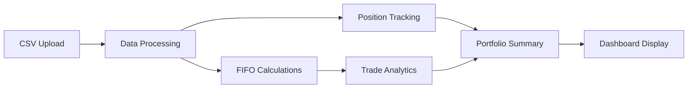

# 📚 Portfolio P&L Dashboard Documentation

Welcome to the comprehensive documentation for the Portfolio P&L Dashboard. This documentation covers everything from architecture and API references to deployment and troubleshooting.

## 🚀 Quick Start

If you're new to the project, start here:

1. **[Main README](../README.md)** - Project overview and quick start guide
2. **[Architecture Overview](./architecture.md)** - System design and component structure
3. **[Deployment Guide](./deployment.md)** - How to deploy to production

## 📖 Documentation Index

### 🏗️ Architecture & Design
- **[Architecture Overview](./architecture.md)** - System architecture, component design, and data flow diagrams
- **[Data Processing Guide](./data-processing.md)** - CSV processing, FIFO calculations, and financial computations

### 🔧 Technical Reference
- **[API Reference](./api.md)** - Complete API documentation, data structures, and function references
- **[Deployment Guide](./deployment.md)** - Production deployment, environment setup, and scaling

### 📊 Feature Guides
- **[CSV Import Guide](#csv-import)** - Supported formats and data requirements
- **[FIFO Calculations](#fifo-calculations)** - Cost basis and P&L calculations
- **[Market Data Integration](#market-data)** - Real-time price updates

## 🎯 Key Features

### 📈 Portfolio Tracking
- Real-time portfolio performance monitoring
- FIFO cost basis calculations
- Realized and unrealized P&L tracking
- Position-specific analytics

### 💾 Data Import
- CSV file processing from major brokers
- Automatic transaction type detection
- Data validation and error handling
- Support for multiple date formats

### 📊 Analytics & Reporting
- Trade pair analysis with holding periods
- Performance metrics and benchmarks
- Portfolio summary and breakdowns
- Historical data tracking

## 🔄 Data Flow Overview



## 📁 Project Structure

```
portfolio-pnl-dashboard/
├── src/
│   ├── components/          # React UI components
│   │   ├── CSVUpload.tsx   # File upload component
│   │   ├── PortfolioSummary.tsx # Portfolio overview
│   │   ├── PositionsTable.tsx   # Current positions
│   │   └── TradeAnalytics.tsx   # Trade analysis
│   ├── utils/              # Business logic
│   │   ├── portfolio.ts    # Core calculations
│   │   └── marketData.ts   # Market data API
│   ├── types/              # TypeScript definitions
│   │   └── trade.ts        # Data interfaces
│   └── assets/             # Static resources
├── docs/                   # Documentation
│   ├── architecture.md     # System design
│   ├── api.md             # API reference
│   ├── data-processing.md  # Data processing guide
│   └── deployment.md      # Deployment guide
└── public/                # Public assets
```

## 🛠️ Technology Stack

| Technology | Purpose | Version |
|------------|---------|---------|
| React | Frontend framework | 18.x |
| TypeScript | Type safety | 5.x |
| Vite | Build tool | 4.x |
| Tailwind CSS | Styling | 3.x |
| Papa Parse | CSV parsing | 5.x |
| Alpha Vantage | Market data | API v1 |

## 📊 Supported Data Formats

### CSV Structure
```csv
"Activity Date","Process Date","Settle Date","Instrument","Description","Trans Code","Quantity","Price","Amount"
"7/24/2025","7/24/2025","7/25/2025","DNUT","Krispy Kreme","Sell","111","$4.28","$475.33"
```

### Transaction Types
- **BUY/SELL** - Stock trades
- **CDIV** - Dividend payments
- **AFEE/GOLD** - Account fees
- **RTP** - Deposits/withdrawals
- **SOFF** - Corporate actions

## 🎯 Calculation Methods

### Price Calculation
- **BUY**: `cost_per = |Amount| / Quantity`
- **SELL**: `sell_per = Amount / Quantity`
- Uses Amount as source of truth

### FIFO Cost Basis
- First-in, first-out inventory method
- Accurate realized P&L calculations
- Proper tax basis tracking

### Portfolio Metrics
- Total invested amount
- Realized vs unrealized gains/losses
- Position-specific performance
- Trade pair analytics

## 🔧 Development Setup

### Prerequisites
- Node.js 18+
- npm or yarn
- Git

### Quick Start
```bash
# Clone repository
git clone <your-repo-url>
cd portfolio-pnl-dashboard

# Install dependencies
npm install

# Start development server
npm run dev
```

### Environment Variables
```bash
# Create .env.local for local development
VITE_ALPHA_VANTAGE_API_KEY=your_api_key_here
VITE_DEV_MODE=true
VITE_ENABLE_LOGGING=true
```

## 🚀 Deployment Options

### Static Hosting (Recommended)
- **Vercel** - Zero-config deployment
- **Netlify** - Git-based deployment
- **GitHub Pages** - Free hosting

### Traditional Web Server
- **Nginx** - High-performance web server
- **Apache** - Feature-rich web server
- **Docker** - Containerized deployment

## 📈 Performance Benchmarks

| Operation | Target Time | Current Time |
|-----------|-------------|--------------|
| CSV Parsing (1000 trades) | < 2s | ~1.5s |
| FIFO Calculation | < 500ms | ~300ms |
| Position Calculation | < 200ms | ~150ms |
| Market Data Update | < 1s | ~800ms |

## 🔍 Troubleshooting

### Common Issues

#### CSV Import Problems
- **Issue**: Invalid CSV format
- **Solution**: Check required columns and data types
- **Reference**: [Data Processing Guide](./data-processing.md)

#### Calculation Errors
- **Issue**: Incorrect P&L calculations
- **Solution**: Verify Amount-based price calculation
- **Reference**: [API Reference](./api.md)

#### Deployment Issues
- **Issue**: Build failures or routing problems
- **Solution**: Check environment configuration
- **Reference**: [Deployment Guide](./deployment.md)

### Getting Help

1. **Check the logs** - Browser console and network tab
2. **Review documentation** - Start with the relevant guide
3. **Validate data** - Ensure CSV format is correct
4. **Test calculations** - Verify expected outputs

## 🤝 Contributing

### Development Workflow
1. Fork the repository
2. Create a feature branch
3. Make your changes
4. Add tests if applicable
5. Submit a pull request

### Code Standards
- TypeScript for type safety
- ESLint for code quality
- Prettier for formatting
- Conventional commits

## 📚 Additional Resources

### External Links
- [React Documentation](https://react.dev/)
- [TypeScript Handbook](https://www.typescriptlang.org/docs/)
- [Vite Guide](https://vitejs.dev/guide/)
- [Tailwind CSS](https://tailwindcss.com/docs)

### Related Projects
- [Alpha Vantage API](https://www.alphavantage.co/documentation/)
- [Papa Parse](https://www.papaparse.com/docs)
- [date-fns](https://date-fns.org/docs/)

## 📄 License

This project is licensed under the MIT License. See the [LICENSE](../LICENSE) file for details.

---

**Need help?** Check the troubleshooting section or create an issue in the repository. 