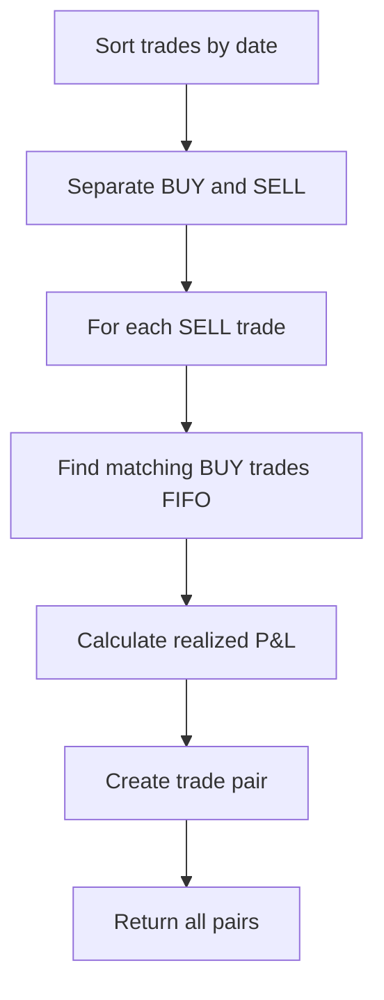
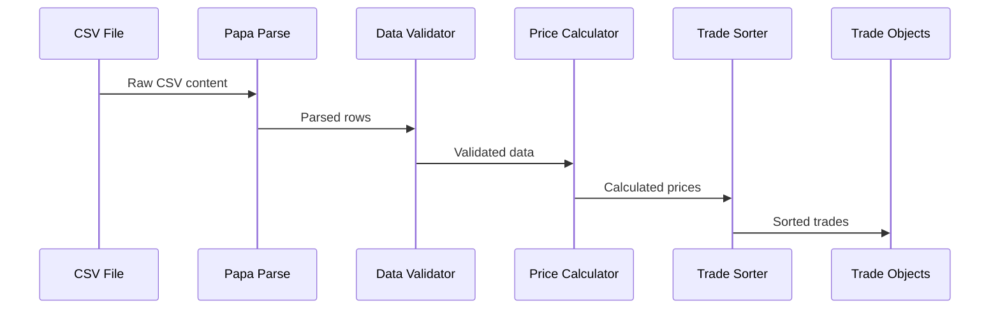
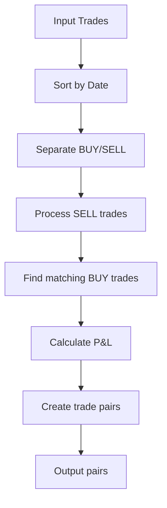

# 🔌 API Reference

This document provides a comprehensive reference for all APIs, functions, and data structures used in the Portfolio P&L Dashboard.

## 📊 Core Data Structures

### Trade Interface
```typescript
interface Trade {
    id: string;           // Unique identifier
    symbol: string;       // Stock symbol
    side: 'BUY' | 'SELL' | 'DIVIDEND' | 'FEE' | 'DEPOSIT' | 'CORP_ACTION';
    quantity: number;     // Number of shares
    price: number;        // Price per share
    date: string;         // Transaction date
    fees?: number;        // Optional fees
}
```

### Position Interface
```typescript
interface Position {
    symbol: string;           // Stock symbol
    quantity: number;         // Current shares owned
    avgBuyPrice: number;      // Weighted average cost
    totalCost: number;        // Total cost basis
    currentPrice?: number;    // Current market price
    marketValue?: number;     // Current market value
    unrealizedPnL?: number;   // Unrealized profit/loss
    unrealizedPnLPercent?: number; // Unrealized P&L percentage
}
```

### Trade Pair Interface
```typescript
interface TradePair {
    buyTrade: Trade;          // Buy transaction
    sellTrade: Trade;         // Sell transaction
    realizedPnL: number;      // Realized profit/loss
    realizedPnLPercent: number; // Realized P&L percentage
    holdingPeriod: number;    // Days held
}
```

### Portfolio Summary Interface
```typescript
interface PortfolioSummary {
    totalCost: number;        // Total invested
    totalMarketValue: number; // Current portfolio value
    totalUnrealizedPnL: number; // Total unrealized P&L
    totalUnrealizedPnLPercent: number; // Unrealized P&L %
    totalRealizedPnL: number; // Total realized P&L
    totalRealizedPnLPercent: number; // Realized P&L %
    totalPnL: number;        // Total P&L
    totalPnLPercent: number; // Total P&L %
    positionCount: number;    // Number of positions
    tradeCount: number;       // Number of trades
}
```

## 🔧 Core Functions

### CSV Data Processing

#### `parseCSVData(csvText: string): Promise<Trade[]>`
Parses CSV data and converts it to Trade objects.

**Parameters:**
- `csvText`: Raw CSV string content

**Returns:** Promise resolving to array of Trade objects

**Example:**
```typescript
const trades = await parseCSVData(csvContent);
console.log(`Parsed ${trades.length} trades`);
```

**Processing Logic:**
1. Uses Papa Parse for CSV parsing
2. Validates transaction types (BUY, SELL, CDIV, etc.)
3. Calculates prices from Amount ÷ Quantity
4. Sorts by Symbol, Date, BUY before SELL
5. Returns validated Trade objects

### FIFO Calculations

#### `calculateFIFOPairs(trades: Trade[]): TradePair[]`
Calculates FIFO trade pairs for realized P&L.

**Parameters:**
- `trades`: Array of Trade objects

**Returns:** Array of TradePair objects

**Algorithm:**


**Example:**
```typescript
const tradePairs = calculateFIFOPairs(trades);
console.log(`Found ${tradePairs.length} trade pairs`);
```

### Position Calculations

#### `calculatePositions(trades: Trade[]): Position[]`
Calculates current portfolio positions.

**Parameters:**
- `trades`: Array of Trade objects

**Returns:** Array of Position objects

**Calculation Logic:**
- Groups trades by symbol
- Calculates weighted average cost for BUY trades
- Reduces position for SELL trades
- Returns current holdings

**Example:**
```typescript
const positions = calculatePositions(trades);
console.log(`Current positions: ${positions.length}`);
```

### Portfolio Summary

#### `calculatePortfolioSummary(positions: Position[], tradePairs: TradePair[], allTrades: Trade[]): PortfolioSummary`
Calculates comprehensive portfolio summary.

**Parameters:**
- `positions`: Current positions
- `tradePairs`: FIFO trade pairs
- `allTrades`: All trades for counting

**Returns:** PortfolioSummary object

**Metrics Calculated:**
- Total cost basis
- Current market value
- Realized and unrealized P&L
- Position and trade counts

## 🌐 External APIs

### Alpha Vantage Market Data

#### `updatePositionsWithMarketData(positions: Position[]): Promise<Position[]>`
Fetches current market prices and updates positions.

**Parameters:**
- `positions`: Array of Position objects

**Returns:** Promise resolving to updated Position objects

**API Endpoint:** `https://www.alphavantage.co/query`

**Example:**
```typescript
const updatedPositions = await updatePositionsWithMarketData(positions);
```

**Rate Limits:**
- Free tier: 5 API calls per minute
- Premium tier: 500 API calls per minute

**Error Handling:**
```typescript
try {
    const updatedPositions = await updatePositionsWithMarketData(positions);
} catch (error) {
    console.error('Market data update failed:', error);
    // Fallback to last known prices
}
```

## 🎨 Utility Functions

### Formatting Functions

#### `formatCurrency(amount: number): string`
Formats numbers as currency strings.

**Parameters:**
- `amount`: Number to format

**Returns:** Formatted currency string

**Example:**
```typescript
formatCurrency(1234.56); // "$1,234.56"
formatCurrency(-567.89);  // "-$567.89"
```

#### `formatPercent(percentage: number): string`
Formats numbers as percentage strings.

**Parameters:**
- `percentage`: Number to format

**Returns:** Formatted percentage string

**Example:**
```typescript
formatPercent(12.34); // "12.34%"
formatPercent(-5.67);  // "-5.67%"
```

### Date Processing

#### `parseDate(dateString: string): Date`
Parses date strings in various formats.

**Parameters:**
- `dateString`: Date string to parse

**Returns:** Date object

**Supported Formats:**
- "M/D/YYYY" (e.g., "7/24/2025")
- ISO format (e.g., "2025-07-24")

**Example:**
```typescript
const date = parseDate("7/24/2025");
console.log(date.toISOString()); // "2025-07-24T00:00:00.000Z"
```

## 📊 Data Processing Pipeline

### CSV Processing Flow



### FIFO Processing Flow



## 🔍 Error Handling

### Common Error Types

#### CSV Parsing Errors
```typescript
interface CSVError {
    message: string;
    row?: number;
    field?: string;
    value?: string;
}
```

#### Market Data Errors
```typescript
interface MarketDataError {
    symbol: string;
    error: string;
    timestamp: Date;
}
```

### Error Handling Patterns

```typescript
// CSV Processing
try {
    const trades = await parseCSVData(csvContent);
} catch (error) {
    if (error.message.includes('No valid trades')) {
        // Handle empty or invalid CSV
    } else {
        // Handle parsing errors
    }
}

// Market Data
try {
    const updatedPositions = await updatePositionsWithMarketData(positions);
} catch (error) {
    // Fallback to cached prices
    console.warn('Market data unavailable, using cached prices');
}
```

## 🚀 Performance Considerations

### Optimization Strategies

1. **Memoization**: Cache expensive calculations
2. **Batch Processing**: Process trades in chunks
3. **Lazy Loading**: Load market data on demand
4. **Debouncing**: Limit API calls

### Performance Benchmarks

| Operation | Target Time | Current Time |
|-----------|-------------|--------------|
| CSV Parsing (1000 trades) | < 2s | ~1.5s |
| FIFO Calculation | < 500ms | ~300ms |
| Position Calculation | < 200ms | ~150ms |
| Market Data Update | < 1s | ~800ms |

## 🔧 Configuration

### Environment Variables

```bash
# Alpha Vantage API
VITE_ALPHA_VANTAGE_API_KEY=your_api_key_here

# Development settings
VITE_DEV_MODE=true
VITE_ENABLE_LOGGING=true
```

### API Configuration

```typescript
interface APIConfig {
    alphaVantageKey: string;
    rateLimit: number; // calls per minute
    timeout: number;   // request timeout in ms
    retryAttempts: number;
}
```

## 📝 Testing

### Unit Tests

```typescript
// Example test for FIFO calculation
describe('calculateFIFOPairs', () => {
    it('should calculate correct realized P&L', () => {
        const trades = [/* test data */];
        const pairs = calculateFIFOPairs(trades);
        expect(pairs[0].realizedPnL).toBe(326.31);
    });
});
```

### Integration Tests

```typescript
// Example test for CSV processing
describe('parseCSVData', () => {
    it('should parse valid CSV correctly', async () => {
        const csvContent = `"Activity Date","Instrument","Trans Code","Quantity","Amount"
"7/24/2025","AAPL","BUY","100","($15,000.00)"`;
        const trades = await parseCSVData(csvContent);
        expect(trades).toHaveLength(1);
        expect(trades[0].symbol).toBe('AAPL');
    });
});
``` 