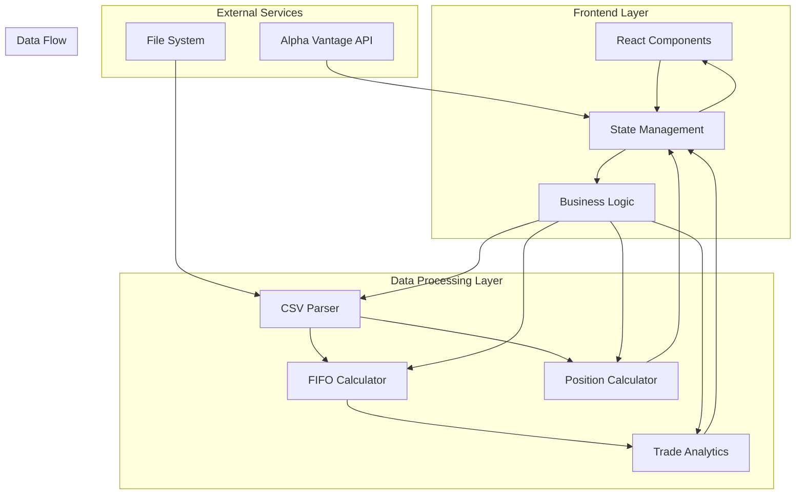
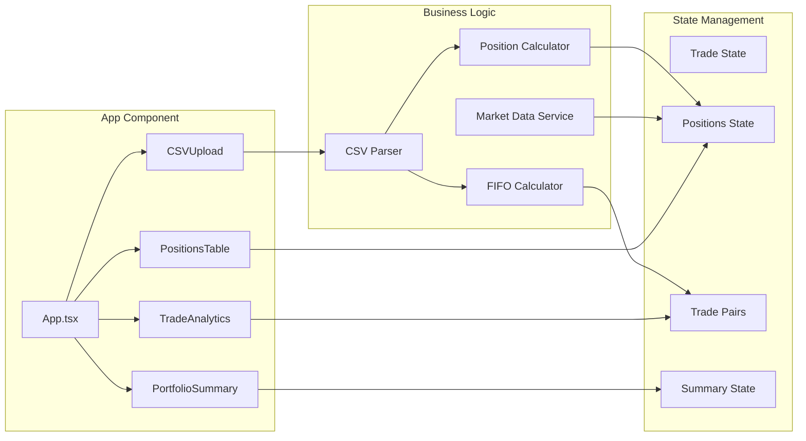
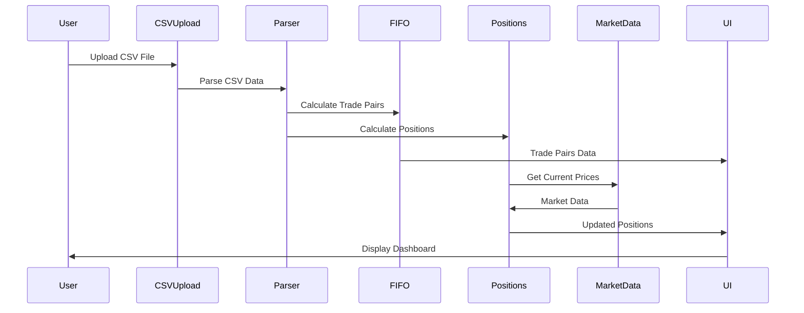
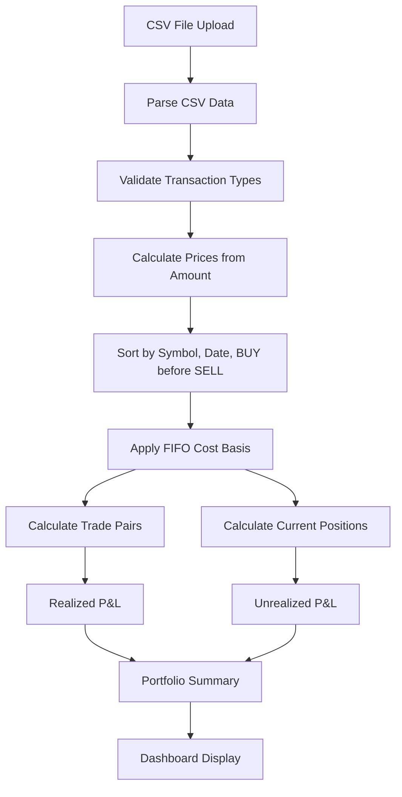

# 🏗️ Architecture Overview

The Portfolio P&L Dashboard is built as a modern single-page application with a focus on real-time data processing and accurate financial calculations.

## System Architecture

## Component Architecture

## Data Flow Architecture

## Data Processing Pipeline

## Key Design Principles

### 1. **Data Accuracy First**
- Uses Amount as source of truth
- FIFO cost basis for accurate tax calculations
- Proper handling of transaction types

### 2. **Real-time Processing**
- Client-side data processing for immediate feedback
- Market data integration for live prices
- Responsive UI updates

### 3. **Modular Architecture**
- Separation of concerns between UI and business logic
- Reusable components
- Type-safe data handling

### 4. **Performance Optimization**
- Efficient CSV parsing with Papa Parse
- Optimized FIFO calculations
- Minimal re-renders with React

## Technology Decisions

### **Frontend Framework: React + TypeScript**
- **Why**: Type safety, component reusability, large ecosystem
- **Benefits**: Better developer experience, fewer runtime errors

### **Build Tool: Vite**
- **Why**: Fast development server, optimized builds
- **Benefits**: Hot module replacement, quick iteration

### **Styling: Tailwind CSS**
- **Why**: Utility-first approach, consistent design system
- **Benefits**: Rapid development, responsive design

### **Data Processing: Custom Utils**
- **Why**: Specific financial calculations require custom logic
- **Benefits**: Full control over accuracy and performance

## Scalability Considerations

### **Current Architecture**
- Single-page application
- Client-side processing
- Real-time market data

### **Future Enhancements**
- Backend API for data persistence
- Database for historical data
- WebSocket for real-time updates
- Multi-user support

## Security Considerations

### **Data Privacy**
- All processing happens client-side
- No data sent to external servers (except market data)
- CSV files processed locally

### **API Security**
- Alpha Vantage API key management
- Rate limiting for market data requests
- Secure HTTPS connections

## Performance Metrics

### **Target Performance**
- CSV processing: < 2 seconds for 1000+ trades
- Dashboard rendering: < 500ms
- Market data updates: < 1 second

### **Optimization Strategies**
- Efficient FIFO algorithms
- Memoized calculations
- Lazy loading of components
- Optimized re-renders

## Monitoring & Debugging

### **Development Tools**
- React Developer Tools
- TypeScript strict mode
- Console logging for data flow
- Error boundaries for graceful failures

### **Production Monitoring**
- Error tracking (future)
- Performance monitoring (future)
- User analytics (future) 