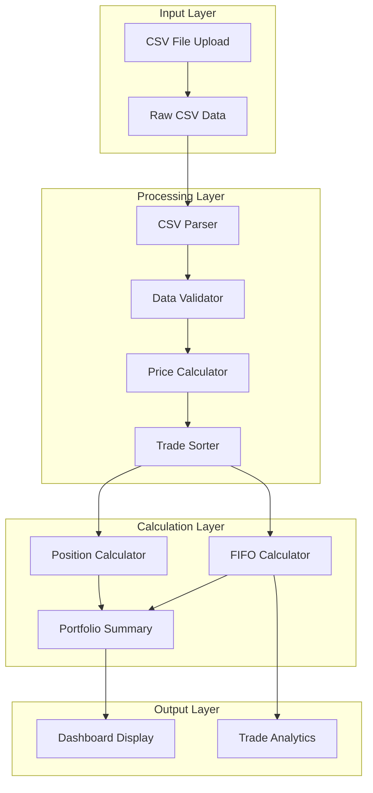
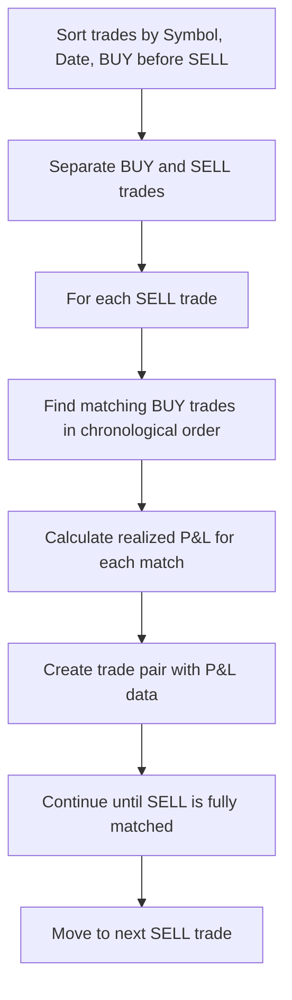
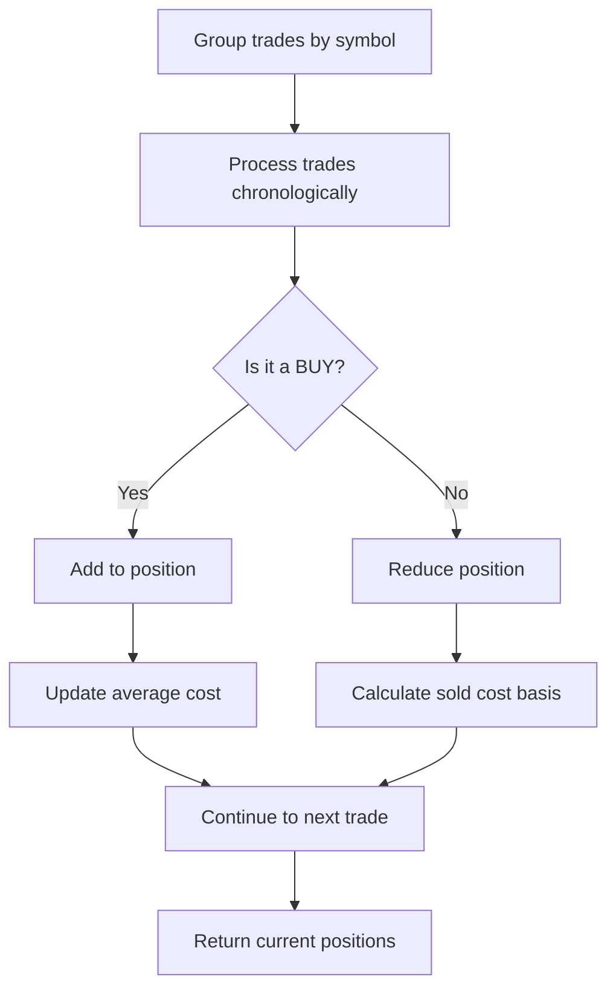

# 📊 Data Processing Guide

This document explains the data processing pipeline, from raw CSV input to calculated portfolio metrics.

## 🔄 Data Processing Pipeline



## 📁 CSV Data Structure

### Supported Format
The dashboard processes CSV files with the following structure:

```csv
"Activity Date","Process Date","Settle Date","Instrument","Description","Trans Code","Quantity","Price","Amount"
"7/24/2025","7/24/2025","7/25/2025","DNUT","Krispy Kreme","Sell","111","$4.28","$475.33"
```

### Required Columns
- **Activity Date**: Transaction date (M/D/YYYY format)
- **Instrument**: Stock symbol
- **Trans Code**: Transaction type
- **Quantity**: Number of shares
- **Amount**: Total transaction amount

### Optional Columns
- **Process Date**: Processing date
- **Settle Date**: Settlement date
- **Description**: Transaction description
- **Price**: Quoted price per share

## 🔧 Transaction Type Mapping

| CSV Trans Code | Internal Type | Description |
|----------------|---------------|-------------|
| `BUY` | `BUY` | Stock purchase |
| `SELL` | `SELL` | Stock sale |
| `CDIV` | `DIVIDEND` | Dividend payment |
| `AFEE` | `FEE` | Account fee |
| `GOLD` | `FEE` | Subscription fee |
| `RTP` | `DEPOSIT` | Cash deposit/withdrawal |
| `SOFF` | `CORP_ACTION` | Corporate action |

## 💰 Price Calculation Logic

### Core Principle: Amount as Truth
The dashboard uses the **Amount** column as the source of truth for all calculations, rather than relying on the **Price** column.

### Calculation Formulas

#### For BUY Transactions
```
cost_per_share = |Amount| / Quantity
```

**Example:**
- Amount: ($1,500.00)
- Quantity: 100 shares
- Cost per share: $1,500.00 ÷ 100 = $15.00

#### For SELL Transactions
```
sell_price_per_share = Amount / Quantity
```

**Example:**
- Amount: $1,600.00
- Quantity: 100 shares
- Sell price per share: $1,600.00 ÷ 100 = $16.00

### Why Amount Over Price?

1. **Includes All Costs**: Amount reflects the actual cash flow including fees, commissions, and taxes
2. **Accuracy**: Eliminates discrepancies between quoted price and actual transaction value
3. **Tax Compliance**: Matches IRS requirements for cost basis calculations

## 🎯 FIFO Cost Basis Calculation

### Algorithm Overview



### Detailed Process

#### 1. Trade Sorting
```typescript
// Sort by: Symbol → Date → BUY before SELL
trades.sort((a, b) => {
    if (a.symbol !== b.symbol) return a.symbol.localeCompare(b.symbol);
    const dateA = parseDate(a.date).getTime();
    const dateB = parseDate(b.date).getTime();
    if (dateA !== dateB) return dateA - dateB;
    if (a.side === 'BUY' && b.side === 'SELL') return -1;
    if (a.side === 'SELL' && b.side === 'BUY') return 1;
    return 0;
});
```

#### 2. FIFO Matching
```typescript
// For each SELL trade
sellTrades.forEach(sellTrade => {
    let remainingQuantity = sellTrade.quantity;
    let matchedBuys = [];
    
    // Find matching BUY trades in chronological order
    for (let buyTrade of buyTrades) {
        if (buyTrade.symbol === sellTrade.symbol && buyTrade.quantity > 0) {
            const matchQuantity = Math.min(remainingQuantity, buyTrade.quantity);
            matchedBuys.push({ trade: buyTrade, quantity: matchQuantity });
            remainingQuantity -= matchQuantity;
            buyTrade.quantity -= matchQuantity; // Mark as used
        }
    }
});
```

#### 3. P&L Calculation
```typescript
// Calculate weighted average buy price
const totalBuyValue = matchedBuys.reduce((sum, match) => 
    sum + (match.trade.price * match.quantity), 0);
const totalBuyQuantity = matchedBuys.reduce((sum, match) => 
    sum + match.quantity, 0);
const avgBuyPrice = totalBuyValue / totalBuyQuantity;

// Calculate realized P&L
const realizedPnL = (sellTrade.price - avgBuyPrice) * sellTrade.quantity;
```

## 📊 Position Calculation

### Current Holdings Logic



### Weighted Average Cost Calculation

For each BUY transaction:
```typescript
// New average cost = (Total cost + New cost) / (Total quantity + New quantity)
const newTotalCost = position.totalCost + (trade.price * trade.quantity);
const newQuantity = position.quantity + trade.quantity;
position.avgBuyPrice = newQuantity > 0 ? newTotalCost / newQuantity : 0;
```

### Position Reduction Logic

For each SELL transaction:
```typescript
// Only sell what we actually own
const sellQuantity = Math.min(trade.quantity, position.quantity);

if (sellQuantity > 0) {
    // Calculate cost basis of shares being sold
    const soldCost = position.avgBuyPrice * sellQuantity;
    
    // Reduce position
    position.quantity -= sellQuantity;
    position.totalCost -= soldCost;
    
    // Recalculate average if still have shares
    if (position.quantity > 0) {
        position.avgBuyPrice = position.totalCost / position.quantity;
    }
}
```

## 🔍 Data Validation

### CSV Validation Rules

1. **Required Fields**: All required columns must be present
2. **Transaction Types**: Only supported transaction codes are processed
3. **Numeric Values**: Quantity and Amount must be valid numbers
4. **Date Format**: Activity Date must be in supported format
5. **Symbol Format**: Instrument must be a valid stock symbol

### Validation Errors

| Error Type | Description | Resolution |
|------------|-------------|------------|
| Missing Required Field | Required column not found | Check CSV format |
| Invalid Transaction Type | Unsupported Trans Code | Review transaction types |
| Invalid Number | Non-numeric quantity/amount | Check data format |
| Invalid Date | Unsupported date format | Convert to M/D/YYYY |
| Empty Symbol | Missing stock symbol | Add valid symbol |

### Error Handling Example

```typescript
try {
    const trades = await parseCSVData(csvContent);
} catch (error) {
    if (error.message.includes('No valid trades')) {
        // Handle empty or invalid CSV
        console.error('No valid trades found in CSV');
    } else if (error.message.includes('Missing required field')) {
        // Handle missing columns
        console.error('CSV missing required columns');
    } else {
        // Handle other parsing errors
        console.error('CSV parsing failed:', error.message);
    }
}
```

## 📈 Performance Optimization

### Processing Strategies

#### 1. Batch Processing
```typescript
// Process trades in chunks for large datasets
const BATCH_SIZE = 1000;
for (let i = 0; i < trades.length; i += BATCH_SIZE) {
    const batch = trades.slice(i, i + BATCH_SIZE);
    processBatch(batch);
}
```

#### 2. Memoization
```typescript
// Cache expensive calculations
const memoizedFIFO = memoize(calculateFIFOPairs);
const memoizedPositions = memoize(calculatePositions);
```

#### 3. Efficient Sorting
```typescript
// Use stable sort for consistent results
const sortedTrades = [...trades].sort((a, b) => {
    // Multi-field sort with early returns
    const symbolCompare = a.symbol.localeCompare(b.symbol);
    if (symbolCompare !== 0) return symbolCompare;
    
    const dateCompare = parseDate(a.date).getTime() - parseDate(b.date).getTime();
    if (dateCompare !== 0) return dateCompare;
    
    return a.side === 'BUY' ? -1 : 1;
});
```

### Performance Benchmarks

| Operation | 100 Trades | 1,000 Trades | 10,000 Trades |
|-----------|------------|---------------|----------------|
| CSV Parsing | ~50ms | ~200ms | ~1.5s |
| FIFO Calculation | ~20ms | ~150ms | ~1.2s |
| Position Calculation | ~10ms | ~80ms | ~600ms |
| Market Data Update | ~500ms | ~2s | ~15s |

## 🔧 Data Transformation Examples

### Example 1: Simple Buy/Sell

**Input CSV:**
```csv
"Activity Date","Instrument","Trans Code","Quantity","Amount"
"7/24/2025","AAPL","BUY","100","($15,000.00)"
"7/25/2025","AAPL","SELL","50","$8,000.00"
```

**Processing:**
1. **BUY**: cost_per = $15,000 ÷ 100 = $150.00
2. **SELL**: sell_per = $8,000 ÷ 50 = $160.00
3. **FIFO Match**: 50 shares sold from 100 share lot
4. **Realized P&L**: (160 - 150) × 50 = $500.00

### Example 2: Multiple Lots

**Input CSV:**
```csv
"Activity Date","Instrument","Trans Code","Quantity","Amount"
"7/24/2025","TSLA","BUY","100","($25,000.00)"
"7/25/2025","TSLA","BUY","50","($12,500.00)"
"7/26/2025","TSLA","SELL","120","$30,000.00"
```

**Processing:**
1. **BUY 1**: cost_per = $25,000 ÷ 100 = $250.00
2. **BUY 2**: cost_per = $12,500 ÷ 50 = $250.00
3. **SELL**: sell_per = $30,000 ÷ 120 = $250.00
4. **FIFO Match**: 
   - 100 shares from first lot: (250 - 250) × 100 = $0
   - 20 shares from second lot: (250 - 250) × 20 = $0
5. **Realized P&L**: $0.00

## 🚨 Common Issues & Solutions

### Issue 1: Incorrect P&L Calculations

**Symptoms:**
- Realized P&L doesn't match expectations
- Negative P&L on profitable trades

**Causes:**
- Wrong price calculation method
- Incorrect FIFO matching
- Missing transaction types

**Solutions:**
- Verify Amount-based price calculation
- Check FIFO algorithm implementation
- Validate transaction type mapping

### Issue 2: Missing Positions

**Symptoms:**
- Current positions don't show all stocks
- Zero quantities for active positions

**Causes:**
- Trades not processed correctly
- Position calculation errors
- Data validation failures

**Solutions:**
- Review CSV parsing logic
- Check position calculation algorithm
- Validate input data format

### Issue 3: Performance Issues

**Symptoms:**
- Slow processing of large datasets
- Browser freezing during calculations

**Causes:**
- Inefficient algorithms
- Large dataset processing
- Memory leaks

**Solutions:**
- Implement batch processing
- Add memoization
- Optimize sorting algorithms 